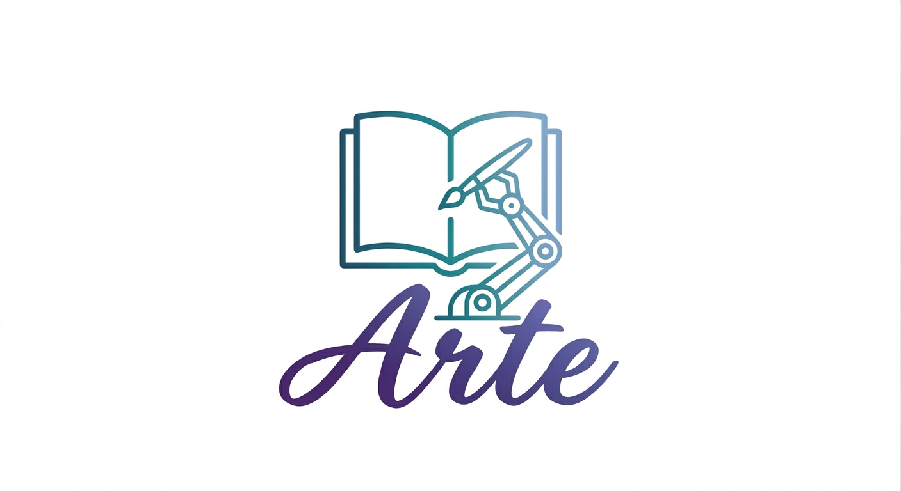

# Team Arte


<div align="center">



###  프로젝트 명 : ABA (Arte Book Asistance)

**[ Presentation ](#)** | **[ Demo ](#)**

</div>

---

## 🚀 프로젝트 개요

> 프로젝트에 대한 한두 문장 요약을 작성해주세요.

### 🛠 기술 스택 (Tech Stack)

| 구분 | 기술 |
|------|------|
| **Language** |   |
| **Framework** |  |
| **Robot** |   |
| **Simulation** |   |
| **Database** |   |
| **GUI** |   |
| **Communication** |   |
| **Tools** |    |

### 📖 프로젝트 시나리오 (Scenario)

> 로봇이 수행하는 작업 흐름을 순서대로 설명해주세요. (아래 이미지는 예시 틀입니다)

#### 1️⃣ 도서 배달 요청 - 고객

<div align="center">

| 📱 도서 요청 | ➡️ | 🗺 경로 생성 | ➡️ | 🦾 상차 | ➡️ | 🤖 배달 | ➡️ | 🙆 배달 완료 |
|:---:|:---:|:---:|:---:|:---:|:---:|:---:|:---:|:---:|

<!-- 시나리오 이미지로 교체 가능:  -->

</div>

#### 2️⃣ 도서 수거 요청 - 직원

<div align="center">

| 📱 수거 요청 | ➡️ | 🦾 상차 | ➡️ | 🤖 배달 | ➡️ | 🦾 하차 | ➡️ | 📚 서가 정리 |
|:---:|:---:|:---:|:---:|:---:|:---:|:---:|:---:|:---:|

<!-- 시나리오 이미지로 교체 가능:  -->

</div>

### 🗺 Map 구성

> 작업 환경(Map) 이미지와 설명을 추가해주세요.


- 구역 설명: ...
- 주요 좌표/스테이션: ...

---

## 📂 Folder Structure

```
arte_readme/                         # pingdergarten 컨벤션
├── README.md
├── docs/                            # 문서, 이미지, 다이어그램
│   └── img/
├── controller/                      # 로봇 온보드 ROS2 (보드별 colcon ws)
│   ├── libi-drive-controller/       #   주행 (nav2)
│   └── libi-handy-controller/       #   팔 (MoveIt)
├── fleet/                           # ★ RMF 관제 (colcon ws) — fleet/src/libi_rmf_*
├── service/                         # 비-ROS 백엔드 (libi_service/aba_service/ai_service/labi_bot)
├── app/                             # PyQt 데스크톱 (libi_gui)
├── web/                             # 웹 (library_member/librarian)
└── db/  scripts/  tests/
```

---

## 🏗 System Architecture

> 전체 시스템 구성도를 추가해주세요. (노드 간 관계, 하드웨어/소프트웨어 구조)


---

## 🚦 Fleet Management System

> 관제 시스템의 역할과 동작 방식을 설명해주세요.

- 로봇 상태 모니터링
- 작업 할당(Task Allocation) 로직
- 경로 관리 / 충돌 회피
- ...


---

## 🔄 Sequence Diagram

> 주요 시나리오에 대한 시퀀스 다이어그램을 추가해주세요.


---

## 🗄 ERD

> 데이터베이스 구조(ERD)를 추가해주세요.


---

## 🔌 Interface Specification

> 노드/모듈 간 통신 인터페이스(Topic, Service, Action, API)를 정리해주세요.

| Name | Type | Direction | Description |
|------|------|-----------|-------------|
| `/robot/goal` | Topic | GUI → Robot | 목적지 전달 |
| `/robot/status` | Topic | Robot → Fleet | 로봇 상태 보고 |
| ... | ... | ... | ... |

---

## 🖥 GUI

> GUI 화면 캡처와 주요 기능을 설명해주세요.


- 주요 기능 1: ...
- 주요 기능 2: ...

---

## ⚙️ 구현 (Implementation)

### 로봇팔 (Robot Arm)

> 구현 방안을 작성해주세요.

- 구현 방안: ...

### 주행로봇 (Mobile Robot)

> 구현 방안을 작성해주세요.

- 구현 방안: ...

---

## 🎬 Demo

### 로봇팔 (Robot Arm)

> 데모 영상 링크를 추가해주세요.

- 데모 영상: [링크](#)

### 주행로봇 (Mobile Robot)

> 데모 영상 링크를 추가해주세요.

- 데모 영상: [링크](#)

---

## 📅 Project Schedule

> 프로젝트 일정(WBS/간트차트)을 추가해주세요.

| 주차 | 기간 | 주요 내용 |
|------|------|-----------|
| 1주차 | MM/DD ~ MM/DD | 기획 / 요구사항 정의 |
| 2주차 | MM/DD ~ MM/DD | 설계 |
| 3주차 | MM/DD ~ MM/DD | 개발 |
| ... | ... | ... |


---

## 👥 팀원 소개

| 이름 | 역할 | 담당 업무 | GitHub |
|------|------|-----------|--------|
| 이강택 | 팀장 | ... | [@id](https://github.com/) |
| 인경일 | 팀원 | ... | [@id](https://github.com/) |
| 정호재 | 팀원 | ... | [@id](https://github.com/) |
| 이형주 | 팀원 | ... | [@id](https://github.com/) |
| 이주형 | 팀원 | ... | [@id](https://github.com/) |
| 이세형 | 팀원 | ... | [@id](https://github.com/) |
